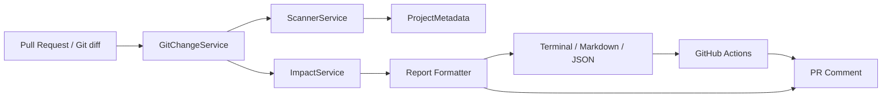

# DataForge AI Architecture

DataForge AI is designed as a small, modular pipeline that maps Git changes to downstream dbt impact.

## Architecture overview

## Component responsibilities

- **GitChangeService**: identifies changed files and maps them to dbt models.
- **ScannerService**: scans the dbt project and builds metadata, dependencies, and test/documentation signals.
- **ImpactService**: computes downstream exposure, risk score, findings, and reasons.
- **Reporting Formatter**: formats the impact report as terminal text, markdown, or JSON.
- **CLI wrapper (`dataforge`)**: exposes `setup-demo` and `analyze-change`, and connects the analysis pipeline to command output.
- **GitHub Actions workflow**: posts markdown reports directly to pull requests.

## Data flow

1. A developer opens a PR or runs `dataforge analyze-change`.
2. Git diffs are analyzed to discover changed dbt models.
3. The project is scanned for lineage, model metadata, and risk flags.
4. A risk report is generated and rendered.
5. The report can be posted to the PR or consumed by automation.
