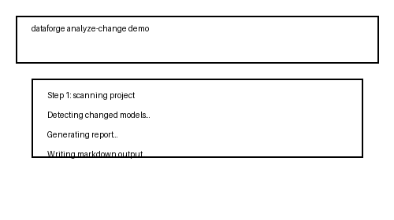
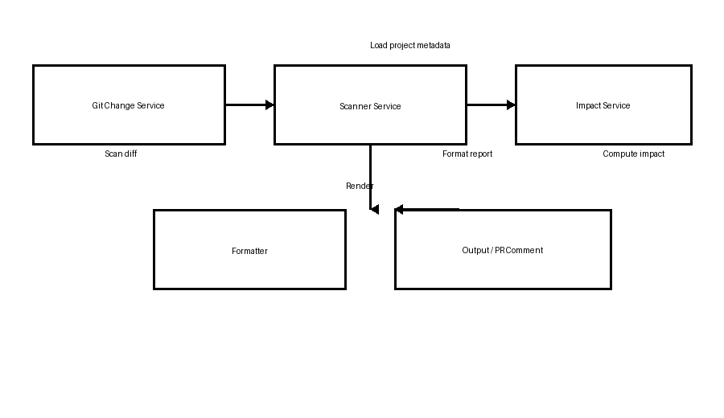

# DataForge AI

DataForge AI analyzes dbt data model changes, detects downstream impact, and surfaces risk before a pull request is merged.

## Why this project exists

When data models change, the risk is often hidden in downstream dependencies, missing tests, or stale documentation. DataForge AI helps teams catch those issues early by:

- detecting changed dbt models in a Git diff
- scanning the project for model lineage and metadata
- computing impact reports, risk scores, and findings
- emitting terminal, JSON, or markdown reports
- posting a PR comment automatically via GitHub Actions

## Quick start

```bash
git clone https://github.com/your-org/dataforge-ai.git
cd dataforge-ai/backend
python -m venv .venv
source .venv/bin/activate
python -m pip install --upgrade pip
python -m pip install -e .
```

## Run the demo

```bash
cd dataforge-ai/backend
./demo/run_demo.sh
```

This flow:

1. creates a sample dbt repo under `backend/demo/sample_dbt_repo`
2. initializes Git and commits the baseline
3. modifies a model on a feature branch
4. runs change analysis and prints the impact report

### What the demo shows

```text
Running demo script...
Initialized empty Git repository in backend/demo/sample_dbt_repo/.git/
Switched to a new branch 'feature'
{
  "changed_models": [
    "orders"
  ],
  "impact_reports": [
    {
      "changed_asset": "orders",
      "risk_level": "medium",
      "risk_score": 40,
      "findings": [
        "2 downstream models",
        "missing tests",
        "missing documentation"
      ]
    }
  ]
}

Running dataforge analyze-change...
## DataForge Impact Report

Risk:
MEDIUM

Score:
40/100

Changed:
- orders

### Impact: orders

Affected:
- customer_metrics
- revenue_dashboard

Findings:
- 2 downstream models
- missing tests
- missing documentation

Reasons:
- downstream dependencies
- missing tests
- missing documentation
```

### Demo GIF



## Use the installable CLI

After install, the entry point is available as `dataforge`:

```bash
cd dataforge-ai/backend
dataforge analyze-change ../examples/demo_dbt_project --markdown
```

## Sample output

```text
## DataForge Impact Report

Risk:
MEDIUM

Score:
40/100

Changed:
- orders

### Impact: orders

Affected:
- customer_metrics
- revenue_dashboard

Findings:
- 2 downstream models
- missing tests
- missing documentation

Reasons:
- downstream dependencies
- missing tests
- missing documentation
```

## Architecture

The core pipeline is:

1. `GitChangeService` detects changed models from Git diff
2. `ScannerService` loads dbt project metadata and lineage
3. `ImpactService` calculates downstream impact and risk
4. Formatter layers render terminal, markdown, or JSON output
5. GitHub Actions posts the report to the PR



See [ARCHITECTURE.md](ARCHITECTURE.md) for a detailed diagram and component breakdown.

## Roadmap

The current status, completed work, and planned milestones are documented in [ROADMAP.md](ROADMAP.md).

## Repository layout

- `backend/dataforge` — CLI wrapper and demo commands
- `backend/app/` — core scanning, impact, reporting, and API logic
- `backend/demo/` — demo harness and sample repo automation
- `examples/` — demo dbt project and breaking-change fixtures
- `.github/workflows/dataforge.yml` — PR-triggered analysis workflow
- `CONTRIBUTING.md` — repository contribution and setup guide

## Quick commands

```bash
cd dataforge-ai/backend
# run change analysis on the example project
dataforge analyze-change ../examples/demo_dbt_project --markdown

# run the GitHub workflow locally by inspecting the workflow file
cat .github/workflows/dataforge.yml
```

## Security

See [SECURITY.md](SECURITY.md) for our security policy and vulnerability disclosure guidance.
